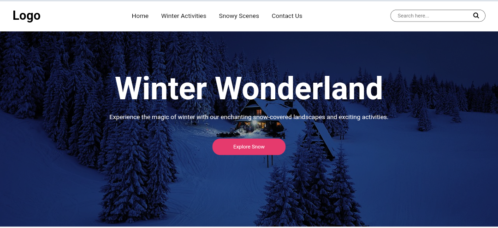

# Winter Wonderland



👇Click here to download image used in webpage</br>
[Download image](https://pixabay.com/photos/snow-winter-mountains-house-home-3373432/)
# Source Code
You can simply copy or download the html and css code.
## HTML
[index.html](index.html)

```html
<!DOCTYPE html>
<html lang="en">

<head>
  <!-- Metadata Section: Character set, viewport, and compatibility -->
  <meta charset="UTF-8">
  <meta name="viewport" content="width=device-width, initial-scale=1.0">
  <meta http-equiv="X-UA-Compatible" content="ie=edge">

  <!-- Title of the webpage -->
  <title>Forest</title>

  <!-- External Stylesheet for Font Awesome Icons -->
  <link rel="stylesheet" href="https://cdnjs.cloudflare.com/ajax/libs/font-awesome/4.7.0/css/font-awesome.min.css">

  <!-- External CSS -->
  <link rel="stylesheet" href="style.css">
</head>

<body>
  <!-- Header Section: Logo, Navigation, and Search Bar -->
  <header>
    <div class="logo">
      <h1>Logo</h1>
    </div>
    <nav>
      <ul>
        <!-- Navigation Links -->
        <li><a href="#">Home</a></li>
        <li><a href="#">Winter Activities</a></li>
        <li><a href="#">Snowy Scenes</a></li>
        <li><a href="#">Contact Us</a></li>
      </ul>
    </nav>
    <!-- Search Bar in the Header -->
    <div class="search-bar">
      <form action="">
        <input type="text" placeholder="Search here...">
        <i class="fa fa-search"></i>
      </form>
    </div>
  </header>

  <!-- Home Section with Heading, Paragraph, and Button -->
  <section class="home">
    <h1>Winter Wonderland</h1>
    <p>Experience the magic of winter with our enchanting snow-covered landscapes and exciting activities.</p>
    <button>Explore Snow</button>
  </section>
</body>

</html>
```
## CSS
[style.css](style.css)

``` css
    /* Resetting default margin and padding, setting font, and background color */
    body {
      margin: 0;
      padding: 0;
      font-family: Arial, Helvetica, sans-serif;
      background: #f3f3f3;
    }

    /* Remove outline when input is focused */
    input:focus {
      outline: 0;
    }

    /* Styling for the header */
    header {
      display: flex;
      justify-content: space-between;
      align-items: center;
      padding: 0px 2em;
      background-color: #fff;
    }

    /* Styling for the navigation bar within the header */
    header nav ul {
      display: flex;
      justify-content: space-between;
      align-items: center;
      list-style-type: none;
    }

    /* Styling for each item in the navigation bar */
    header nav ul li {
      margin-right: 2em;
    }

    /* Styling for links within the navigation bar */
    header nav ul li a {
      text-decoration: none;
      color: #000;
    }

    /* Styling for the search bar in the header */
    header .search-bar {
      border: 1px solid #000;
      border-radius: 20px;
      padding: 5px 1em;
    }
    header .search-bar input[type="text"] {
      border: none;
    }

    /* Styling for the home section */
    .home {
      display: flex;
      justify-content: center;
      align-items: center;
      flex-direction: column;
      height: 650px;
      width: 100vw;
      color: #fff;
      background: linear-gradient(rgba(0, 0, 0, 0.3), rgba(0, 0, 0, 0.3)), url("background.jpg");
      background-repeat: no-repeat;
      background-size: cover;
      position: relative;
      top: -150px;
      z-index: -1;
    }

    /* Styling for the h1 element within the home section */
    .home h1 {
      text-align: center;
      font-size: 5em;
      margin-bottom: 0px;
    }

    /* Styling for the button within the home section */
    .home button {
      background: #E53A6D;
      border-radius: 20px;
      border: 0;
      margin: 30px 0px 0px 0px;
      padding: 1em 4em;
      color: #fff;
    }

    /* Styling for button hover effect */
    .home button:hover {
      background: transparent;
      border: 2px solid #EA7220;
      color: #EA7220;
    }
```
